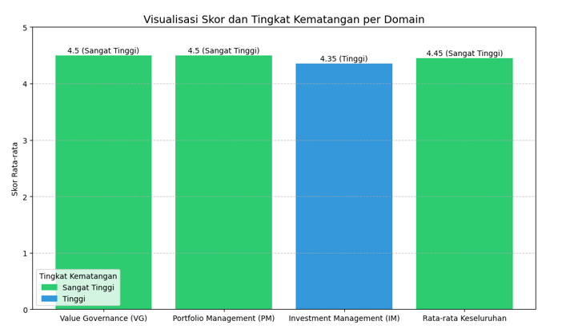

# IT Governance Evaluation: E-Semesta UIN Jakarta
### Measuring IT Investment Value using Val IT 2.0 Framework

## Executive Summary
This project evaluates the IT Governance Maturity of E-Semesta, the new Academic Information System at UIN Syarif Hidayatullah Jakarta.

Using ISACA's Val IT 2.0 Framework, I conducted a comprehensive audit to determine if the IT investment aligns with the university's strategic goals and delivers optimal business value. The audit focused on three key domains: Value Governance (VG), Portfolio Management (PM), and Investment Management (IM).

---

## The Objective
Many IT projects fail not because of bad code, but because of poor governance (lack of planning, weak monitoring, or undefined business value).
The goal of this audit was to:
1.  Measure the maturity level of IT investment management.
2.  Identify gaps in the current governance process.
3.  Provide data-driven recommendations to the IT Directorate (PUSTIPANDA).

---

## Key Findings & Analysis

### 1. Overall Maturity Level
The audit revealed a **"Very High"** maturity level (Score: 4.45 / 5.00), indicating strong strategic alignment and leadership support.

*(Figure: Maturity Level Visualization across 3 Domains)*

| Domain | Score | Status |
| :--- | :--- | :--- |
| **Value Governance (VG)** | **4.50** | Very High |
| **Portfolio Management (PM)** | **4.50** | Very High |
| **Investment Management (IM)** | **4.35** | High |

### 2. The Weak Spot (Gap Analysis)
Despite high overall scores, I discovered a critical weakness in the **Investment Management (IM)** domain:
* **Weakness:** *Post-Implementation Evaluation* (IM10) scored the lowest (3.5 / 5.0).
* **Insight:** The organization is excellent at *planning* and *building* systems, but often neglects to evaluate the actual benefits (ROI) after the system goes live.

---

## Strategic Recommendations
Based on the gap analysis, I proposed the following improvements to the CIO/Management:

1.  **Mandatory Post-Implementation Review (PIR):**
    Establish a formal review process 6 months after launch to measure if the *Actual ROI* matches the *Projected ROI*.
2.  **Standardize Business Case:**
    Every new feature request must include a complete Business Case document (IM5) before budget approval.

---

## Methodology & Tools
* **Framework:** ISACA Val IT 2.0.
* **Methodology:** Quantitative Analysis (Likert Scale) & Gap Analysis.
* **Tools:** Google Forms (Data Collection), Excel/SPSS (Data Analysis).
* **Soft Skill:** Stakeholder Interview & Strategic Thinking.

---
